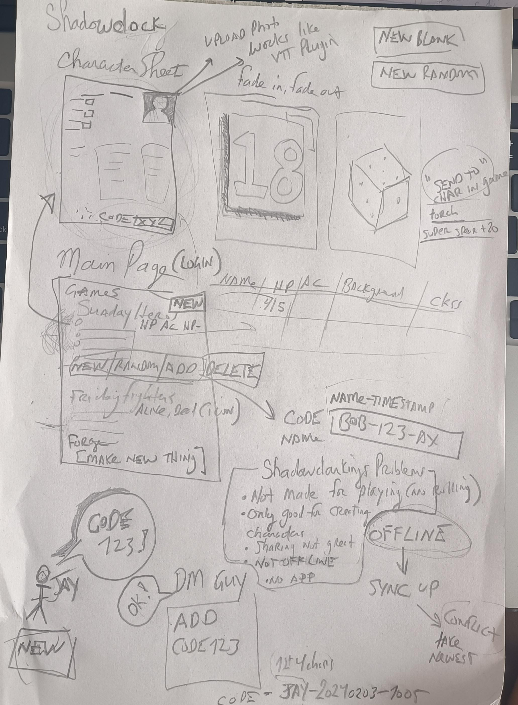

# Shadowdock

WORK IN PROGRESS BY JEFF AND JAY FOR OUR SHADOWDARK GAMES

This repo is just testing out what it'd take to build a playable verison of [Shadowdarklings](https://shadowdarklings.net/) - like Shadowdarklings meets [Foundary Shadowdark plugin](https://github.com/Muttley/foundryvtt-shadowdark), designed for players to collab and play together but not needing FoundaryVTT, Owlbear etc -- just basic shareable character sheets, playable realtime. 

What we want:

- Create random characters
- Create fillable characters
- Character sheet has stats + gear etc
- You can roll right off your character sheet
   - Basic stat rolls (STR check)
   - Weapon rolls -> click weapon, roll, it does the calculations
   - Other players who have your character in their game see the dice roll results
- You can have a list of characters in games (main page)
- Main page shows list of characters + their basic stats (AC / HP as x/y etc)
- You can share characters with other players ==> adds to their list
  - Share by code ("Hey GM, add my character to your list, the code is Bob-20240102-1011")
  - Main page lists your chars + any imported by code (no limitations, permissions, etc - just gimme the code, and I'll import you). 
  - Once you import a char, you own it as much as anyone else and can edit it etc. 
- Offline works (more or less, TBD)

